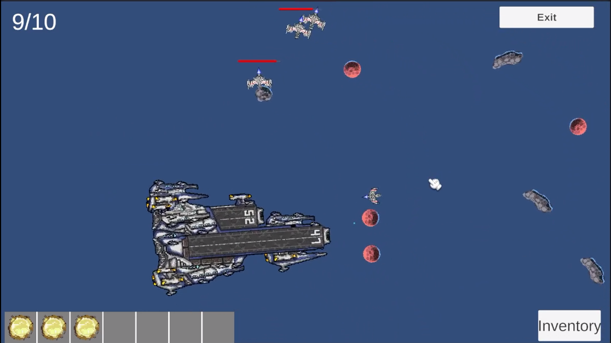
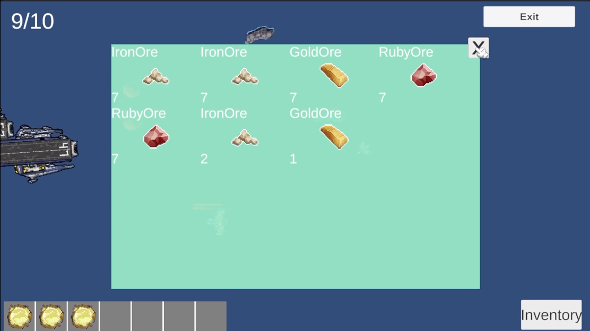
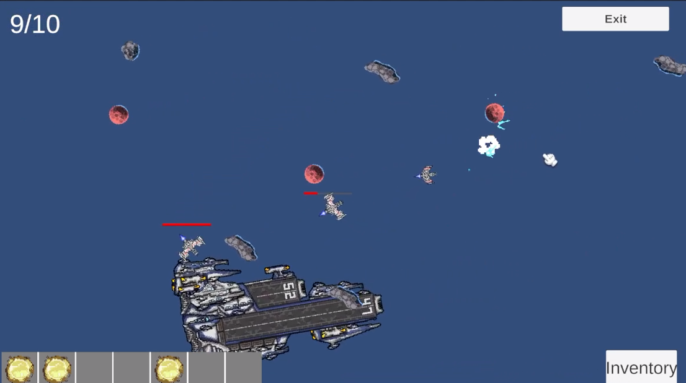

# This is Project tutorial from [SaiGame](https://www.youtube.com/watch?v=gDA5vVMmAoo&list=PL9YFzEkTXjbOUFE0wCrSa4SAjJN7Nz6yq). It name is C3 in *C3 series*. (2D game)
(Note: This series is for channel members only, which costs 30k/month. )
### 💡 Things Learned:
1. Design Patterns
    1. Simple Singleton
    2. Simple Pooling: bullet, enemy, meteorite, etc.
    3. Simple Observer: damage system, inventory system, etc.
    4. Mediator Pattern: 
        * Example: A_parent manages all its children like: A1, A2, A3, etc.
        * A1 and A2 never talk to each other directly.
        * if A1 wants something done, it tells A_parent.
2. Other
    1. UI for Basic:
        * Settings:
        * Hp Bar like: enemies, player, etc.
        * Interface Display Skill player: switch between skill slots.
        * Inventory
    2. System:
        * Handle event item droped when Enemy or Meteorite is broken. User can claim by clicking on the item.
        * Spawner/Despawner: enemy, meteorite, bullet, etc.
        * Abilities: Dash, Warp, Enemy Mom skill
        * Used ScriptableObject for game data like: player stats, item data, etc.
        * Base System: Created a base structure for core entities (enemy, player, item), making it easy to extend or add new ones.
### 🧾 Sumary when I compled the course
* ✅ Became more familiar with the Unity Engine.
* ✅ I really like this series, especially learning the gameplay systems and code structure (like OOP and Design Patterns). It is rare to find a 'zero-to-complete-game' series for beginners in Vietnamese.
* ⚙️ For me, the code has limited reusability, because real game projects require more than just this. 😅
* 👍👍👍Howerver, I recommend this course.
### Preview:
* 
* 
* 
